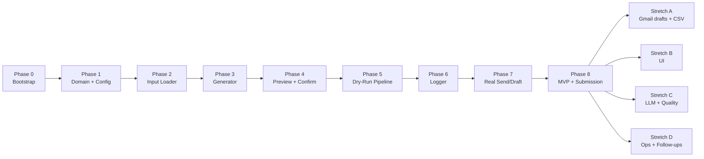

# Phase-Wise Implementation Plan: The Closer

This plan turns [architecture.md](./architecture.md) and [problemStatement.md](./problemStatement.md) into a build sequence suitable for a live Cursor demo, solo development, or a multi-session sprint.

**Principles**

- Build **vertical slices** early (see one email end-to-end before polishing).
- Keep **safety defaults** on until Phase 7 (`DRY_RUN=true`, draft-first where possible).
- Each phase ends with a **verifiable checkpoint**—something you can run or show in the terminal.
- Do not start stretch work until **Phase 8 (MVP complete)** passes acceptance criteria.

---

## Phase Map



| Phase | Focus | Outcome | Est. time (live demo) |
|-------|--------|---------|------------------------|
| 0 | Repo + tooling | Runnable empty project | 15–20 min |
| 1 | Models + config | Typed data + `.env` | 20–30 min |
| 2 | Input (FR1) | Load 3–5 contacts | 20 min |
| 3 | Generator (FR2) | Subject + body per contact | 30–40 min |
| 4 | Preview (FR3) | Human review gate | 20 min |
| 5 | Orchestrator + dry-run | Full loop, no network | 25 min |
| 6 | Logger (FR5) | `outreach_log.csv` | 20 min |
| 7 | Sender (FR4) | Real draft/send | 30–45 min |
| 8 | Hardening + proof | Submission-ready MVP | 30–60 min |
| Stretch | Optional enhancements | See §Stretch phases | Variable |

---

## Traceability: Requirements → Phases

| ID | Requirement | Phase(s) |
|----|-------------|----------|
| FR1 | Load outreach targets | 2 |
| FR2 | Generate personalized cold email | 3 |
| FR3 | Preview before sending | 4 |
| FR4 | Send or draft email | 5 (dry-run), 7 (real) |
| FR5 | Logging | 6 |
| NFR | Safe, modular, env-based config | 0–1, 5, 7–8 |
| Ethics | Human review, low volume, no fabrication | 3–5, 8 |
| Acceptance (§17) | All criteria | 8 |
| Submission (§18) | Repo + screenshots + log + README | 8 |

---

## Phase 0: Project Bootstrap

**Goal:** Create a minimal, runnable Python project with secrets excluded from git.

### Tasks

- [ ] Initialize repo layout per architecture §10 (`src/closer/` packages by phase)
- [ ] Add `requirements.txt` with `python-dotenv` (add SMTP/Gmail deps in Phase 7 only if needed)
- [ ] Add `.gitignore` (`__pycache__/`, `.env`, `*.pyc`, virtualenv)
- [ ] Add `.env.example` with placeholders from problem statement §13
- [ ] Add stub `README.md` with layout table + how to run (filled in Phase 8)
- [ ] Create phase folders under `src/closer/`: `cli`, `config`, `domain`, `input`, `generation`, `preview`, `delivery`, `audit` (each with `__init__.py` stub)
- [ ] Add root `main.py` entrypoint and `data/`, `logs/` directories
- [ ] Verify: `python main.py` prints a placeholder message and exits 0

### Files

| File / folder | Action |
|---------------|--------|
| `requirements.txt` | Create |
| `.env.example` | Create |
| `.gitignore` | Create |
| `main.py` | Root entry; adds `src/` to path, calls `closer.cli.main` |
| `src/closer/cli/main.py` | Bootstrap message (orchestrator in Phase 5) |
| `src/closer/{config,domain,input,generation,preview,delivery,audit}/` | Phase stubs |
| `data/`, `logs/` | Placeholders for inputs and runtime logs |

### Exit criteria

- Project runs from repo root in Cursor terminal
- No secrets committed; `.env.example` documents all vars

### Teaching note

Explain the **four-module pipeline** (load → generate → preview → send → log) before writing business logic.

---

## Phase 1: Domain Models & Configuration

**Goal:** Define shared types and load runtime settings from the environment.

**Maps to:** Architecture §6 (domain model), §5.7 (`config.py`), problem statement §5 (inputs), §13 (env vars).

### Tasks

- [ ] Implement `models.py`:
  - `Contact` — all input fields from problem statement §5
  - `EmailDraft` — `subject`, `body`, `word_count`
  - `LogEntry` — fields for `outreach_log.csv`
  - `DeliveryResult` — `status`, `provider_message_id`, `error`
- [ ] Implement `config.py`:
  - `AppConfig` dataclass: SMTP settings, `SENDER_NAME`, `DRY_RUN`, `SEND_MODE`, `MAX_OUTREACH_PER_RUN`, `INPUT_PATH`, and optional stretch LLM vars (`GROQ_API_KEY`, `LLM_PROVIDER`, `LLM_MODEL`)
  - `load_config()` using `python-dotenv`; default `DRY_RUN=true`
- [ ] Add helper: `count_words(text: str) -> int` (used in Phase 3)
- [ ] Verify: small script or `python -c` loads config from `.env.example` copy

### Exit criteria

- `Contact` and `EmailDraft` importable from other modules
- `load_config()` fails with a clear message if required vars missing when `DRY_RUN=false` (can defer strict check to Phase 7)

### Dependencies

- Phase 0 complete

---

## Phase 2: Input Loader (FR1)

**Goal:** Load 3–5 outreach targets and validate required fields.

**Maps to:** Architecture §5.2, problem statement §5, demo Step 1.

### Tasks

- [ ] Create `contacts.json` with **3 sample records** (expand to 5 in Phase 8)
- [ ] Implement `input_loader.py`:
  - `load_targets(path: str | None) -> list[Contact]`
  - Start with **hardcoded list** in `main.py` OR JSON—teaching path: hardcode first, then switch to JSON in same phase
  - Parse JSON into `Contact` objects
- [ ] Validation per architecture §5.2:
  - Required: `recipient_email`, `company`, `role`, `candidate_name`, `candidate_background`
  - Email format check (simple regex or `email.utils`)
  - Skip invalid rows with terminal warning OR fail fast (pick one; document in README)
- [ ] Default `recipient_name` to `"there"` when missing
- [ ] Wire `INPUT_PATH` from config (default `contacts.json`)
- [ ] Verify: `load_targets()` prints count and first contact’s company/role

### Sample `contacts.json` fields

Include at least one record **with** `personalization_note` and one **without** (tests generator fallback in Phase 3).

### Exit criteria

- Loading returns 3+ valid `Contact` instances
- Missing required field on a record is handled visibly (skip or error)

### Demo checkpoint

```text
Loaded 3 outreach targets.
  1. Acme AI — Backend Engineering Intern
  2. ...
```

---

## Phase 3: Email Generator (FR2)

**Goal:** For one `Contact`, produce a subject and body that follow cold-email anatomy and constraints.

**Maps to:** Architecture §5.3, problem statement §7, demo Step 2.

### Tasks

- [ ] Implement `email_generator.py`:
  - `generate_email(contact: Contact, config: AppConfig) -> EmailDraft`
- [ ] Template must include all six sections (problem statement §7):
  1. Subject — e.g. `Quick note on the {role} role`
  2. Personalization hook — `personalization_note` OR `company` + `role` fallback
  3. Introduction — `candidate_name`, `candidate_background`
  4. Value / fit — tie background to `role`
  5. One clear ask — single CTA
  6. Sign-off — name + optional `portfolio_url`
- [ ] Set `word_count` on `EmailDraft`; warn if `> 150` (print warning or set flag)
- [ ] **No invented facts** — only use fields present on `Contact`
- [ ] Add `if __name__ == "__main__"` block: load one contact, print subject + body
- [ ] Verify: manual run shows 3 distinct emails for 3 companies

### Exit criteria

- `generate_email()` returns subject + body for every valid contact
- Emails differ by company/role; hook is not identical across all samples
- Word count ≤ 150 for typical samples (or warning shown)

### Optional (same phase)

- [ ] Second template variant (e.g. company name in subject) selected by simple rule

---

## Phase 4: Preview & Confirmation (FR3)

**Goal:** Display each draft clearly and require an explicit user decision before delivery.

**Maps to:** Architecture §5.4, problem statement §8 FR3, demo Steps 3–4.

### Tasks

- [ ] Add `preview.py` (or functions in `main.py` for MVP):
  - `preview_email(draft, contact)` — print separator, company, role, recipient, subject, body, word count
  - `prompt_action() -> Literal["send", "draft", "skip"]`
- [ ] Prompt text: `Send this email? (send/draft/skip):`
- [ ] Normalize input (`y`/`yes` → send only if you add aliases; minimum: exact keywords)
- [ ] Invalid input re-prompts or defaults to `skip` (document behavior)
- [ ] Verify: running preview on one draft shows full content; choosing `skip` does not call sender

### Exit criteria

- User always sees full subject and body before any send path
- `skip` is always available
- No email provider called in this phase

### Safety rule (document in code comment)

> Never call `deliver_email` without passing through `prompt_action`.

---

## Phase 5: Orchestrator & Dry-Run Pipeline

**Goal:** Wire the full per-contact state machine with **no real email network I/O**.

**Maps to:** Architecture §5.1 state machine, §5.5 `DryRunEmailSender`, demo Step 5 (DRY_RUN), problem statement workflow.

### Tasks

- [ ] Implement `email_sender.py`:
  - `DryRunEmailSender` or `deliver_email(...)` branch when `config.dry_run`
  - Returns `DeliveryResult(status="sent"|"drafted")` with fake success
- [ ] Implement `main.py` orchestrator:
  - `run_outreach_pipeline()` per architecture pseudocode
  - Load config → load targets → apply `MAX_OUTREACH_PER_RUN` cap
  - Loop: generate → preview → prompt → dry-run deliver OR skip
- [ ] On `skip`: continue without sender
- [ ] On `send`/`draft` with `DRY_RUN=true`: log-friendly message, no SMTP
- [ ] Print **batch summary** at end: generated / skipped counts
- [ ] Verify: full run through 3 contacts with mixed send/skip choices

### Exit criteria

- End-to-end CLI loop works with `DRY_RUN=true`
- Volume cap respected (e.g. stops after 5 even if more in JSON)
- State transitions match: Generated → Previewed → Skipped | Delivering (simulated)

### Dependencies

- Phases 1–4 complete

---

## Phase 6: Logging (FR5)

**Goal:** Append every outreach attempt to `outreach_log.csv` for proof and debugging.

**Maps to:** Architecture §5.6, problem statement §8 FR5, demo Step 6.

### Tasks

- [ ] Implement `logger.py`:
  - `append_log(entry: LogEntry, path="outreach_log.csv")`
  - Create file with CSV header if missing
  - Columns: `timestamp`, `recipient_email`, `company`, `role`, `subject`, `status`, `error_message` (add `word_count`, `job_url` if desired)
- [ ] Status values: `generated`, `drafted`, `sent`, `skipped`, `failed`
- [ ] Integrate into `main.py` after every branch (skip, dry-run, future real send)
- [ ] With `DRY_RUN=true`, use `generated` or `dry_run` consistently (document in README)
- [ ] Verify: after one run, CSV has one row per contact processed; re-run appends rows

### Exit criteria

- Every previewed contact produces exactly one log row per run
- Header row present; timestamps ISO-8601
- Failed sends (Phase 7) include `error_message`

### Dependencies

- Phase 5 complete

---

## Phase 7: Real Email Delivery (FR4)

**Goal:** Send or draft a real email through one provider, starting with a **self-test**.

**Maps to:** Architecture §5.5, problem statement §8 FR4, demo Steps 7–8.

### Tasks

- [ ] Choose **one** provider for MVP:
  - **Recommended for teaching:** SMTP + Gmail App Password
  - **Safer demo:** Gmail API draft mode (stretch variant of same phase)
- [ ] Implement `SmtpEmailSender` (or Gmail adapter):
  - `deliver_email(draft, contact, config, mode)`
  - STARTTLS on port 587
  - From: `SMTP_USER` / `SENDER_NAME`
  - To: `contact.recipient_email`
- [ ] Respect `SEND_MODE`: `draft` vs `send` (SMTP may only support send; if so, document and use draft via Gmail API as stretch)
- [ ] When `DRY_RUN=false` and user confirms `send`/`draft`, call real provider
- [ ] Map provider errors to `DeliveryResult(status="failed", error=...)`
- [ ] **Self-test procedure:**
  1. Set first contact’s email to your own address
  2. `DRY_RUN=false`, confirm one email
  3. Verify in Gmail Sent or Drafts
- [ ] Update README: App Password setup, never commit `.env`

### Exit criteria

- One real email arrives in your inbox or Drafts folder
- Log row shows `sent` or `drafted`
- Auth failure shows actionable terminal error

### Safety checklist before live send

- [ ] Human confirmation still required (Phase 4)
- [ ] `MAX_OUTREACH_PER_RUN` ≤ 5
- [ ] First live test only to **your own** email

### Dependencies

- Phases 5–6 complete
- Local `.env` with valid credentials

---

## Phase 8: MVP Hardening & Submission

**Goal:** Meet all acceptance criteria and final submission requirements.

**Maps to:** Problem statement §14–18, architecture §12 acceptance traceability.

### Tasks

#### 8.1 Data & generation quality

- [ ] Expand `contacts.json` to **≥5** diverse records
- [ ] Run pipeline for all 5; confirm company/role-specific hooks
- [ ] Fix any emails over 150 words (trim template or shorten copy)

#### 8.2 Guardrails (ethics §10)

- [ ] Enforce `MAX_OUTREACH_PER_RUN` in orchestrator
- [ ] Warn if `personalization_note` empty and hook is weak
- [ ] Confirm sender identity matches `SMTP_USER` / `candidate_name`

#### 8.3 Error handling (architecture §8)

- [ ] Clear messages for missing env, SMTP auth, invalid email
- [ ] Never drop a user-confirmed send without a `failed` log row

#### 8.4 Documentation & submission artifacts

- [ ] Complete `README.md`:
  - What the app does (5–10 sentences)
  - Setup: venv, `pip install`, `.env`
  - How to run: `python main.py`
  - Sending method used (SMTP / Gmail API / etc.)
  - Safety: DRY_RUN, human review, low volume
- [ ] Capture **screenshots** of 5 drafted or sent personalized emails
- [ ] Commit `outreach_log.csv` from a real run (redact if needed for public repo)
- [ ] Optional: `pytest` for `generate_email` word count and required sections

### MVP acceptance checklist (§17)

| Criterion | How to verify |
|-----------|----------------|
| ≥5 personalized emails | 5 rows in log; 5 distinct previews |
| Subject + body each | Inspect log / screenshots |
| Company/role personalization | Manual read of 2+ samples |
| Preview before send | FR3 still in loop |
| Send or draft works | Screenshots + log status |
| Each attempt logged | `outreach_log.csv` complete |
| Proof in Sent/Drafts | Screenshots attached |

### Final submission package (§18)

1. GitHub repo or zip  
2. Screenshot of 5 emails  
3. `outreach_log.csv`  
4. README explanation  
5. Note on sending method  

### Badge (§19) — optional stretch of Phase 8

- [ ] 3 emails **sent** from student’s own address, screenshot posted publicly  

### Exit criteria

**MVP is done** when all acceptance checklist items pass.

---

## Stretch Phases (Post-MVP)

Build only after Phase 8. Each stretch phase is independent unless noted.

---

### Stretch A: Safer delivery & file input

**Goal:** Draft-first Gmail and CSV contacts.

| Task | Module |
|------|--------|
| Gmail API draft creation | `GmailApiEmailSender` in `email_sender.py` |
| OAuth / service account setup docs | `README.md` |
| Load `jobs.csv` | `input_loader.py` |
| Column mapping config | `config.py` |

**Exit criteria:** Draft appears in Gmail Drafts without sending; 5 contacts load from CSV.

---

### Stretch B: Streamlit UI

**Goal:** Same pipeline, visual preview and buttons.

| Task | Module |
|------|--------|
| `ui/app.py` — contact picker, preview pane | New |
| Call `generate_email`, `deliver_email`, `append_log` | Reuse core modules |
| Do not duplicate business logic in UI | Architecture §11 |

**Exit criteria:** Generate + confirm + log from browser; sender still respects `DRY_RUN`.

---

### Stretch C: LLM & quality plugins

**Goal:** Improve tone without breaking safety rules.

| Task | Module |
|------|--------|
| `GroqEmailGenerator` implementing same interface via Groq API | `email_generator.py` |
| `EmailQualityValidator` — word count, banned phrases | New `validators.py` |
| Spam-risk / quality score before preview | Plugin hook in `main.py` |
| Multiple subject lines; user picks in preview | `preview.py` |
| Add Groq settings to `.env.example` (`GROQ_API_KEY`, `LLM_PROVIDER=groq`, `LLM_MODEL`) | `.env.example` |

**Exit criteria:** Groq-generated output passes validator; user still confirms before send; no fabricated experience.

---

### Stretch D: Operations & follow-ups

**Goal:** Avoid duplicate outreach and support follow-up sequences.

| Task | Module |
|------|--------|
| `RecipientRegistry` from `outreach_log.csv` | New |
| `do_not_contact.csv` opt-out filter | `input_loader.py` |
| `followup_generator.py` + `parent_id` in log | New |
| Deduplication before loop | `main.py` |

**Exit criteria:** Second run skips already-contacted emails; opt-out list honored.

---

## Suggested Session Plan (3 live classes)

| Session | Phases | Demo to students |
|---------|--------|------------------|
| 1 | 0 → 3 | “We can load jobs and write a good cold email in code.” |
| 2 | 4 → 6 | “We review every email and log proof—still safe, no send.” |
| 3 | 7 → 8 | “One real email to yourself, then five for submission.” |

---

## Per-Phase Verification Commands

Use these as quick smoke tests after each phase.

| Phase | Command / action | Expected |
|-------|------------------|----------|
| 0 | `python main.py` | Placeholder / help text |
| 1 | Import `Contact`, `load_config()` | No import errors |
| 2 | Run loader test / print targets | 3+ contacts |
| 3 | `python email_generator.py` | Subject + body printed |
| 4 | Preview one draft in loop | Full email visible |
| 5 | `DRY_RUN=true python main.py` | Full loop, no network |
| 6 | Inspect `outreach_log.csv` | Row per contact |
| 7 | Send to self | Email in Sent/Drafts |
| 8 | Full run × 5 contacts | Submission artifacts ready |

---

## Risk Register (by phase)

| Phase | Risk | Mitigation |
|-------|------|------------|
| 2 | Invalid JSON | Validate early; sample file in repo |
| 3 | Generic emails | Require `candidate_background`; test fallback hook |
| 4 | Accidental send | No sender wired until Phase 5+; dry-run default |
| 7 | Credential leaks | `.gitignore`, `.env.example` only |
| 7 | SMTP blocked | Document App Password; fallback provider in README |
| 8 | Over 150 words | `word_count` in preview + generator warning |

---

## Definition of Done

| Milestone | Definition |
|-----------|------------|
| **Phase 5 done** | Teachable demo without credentials |
| **Phase 7 done** | One real email proven in Gmail |
| **MVP done (Phase 8)** | All §17 acceptance + §18 submission items |
| **Stretch done** | Selected stretch phase exit criteria met |

---

## Related Documents

- [problemStatement.md](./problemStatement.md) — requirements, constraints, acceptance
- [architecture.md](./architecture.md) — modules, interfaces, safety envelope

When implementation details conflict, prefer **safety requirements** from the problem statement, then **module boundaries** from the architecture.
